# Implementing custom animations to NX themes

*Written by [Capybara](https://themezer.net/creators/382997176307154945), March 2023*

## Table of contents

- [I. Introduction](#i-introduction)
- [II. Requirements](#ii-requirements)
- [III. Before actually starting](#iii-before-actually-starting)
	- [III.1. A few words on .szs files](#iii1-a-few-words-on-szs-files)
	- [III.2. Layout Editor and diffing](#iii2-layout-editor-and-diffing)
	- [III.3. Summing up the process](#iii3-summing-up-the-process)
- [IV. Tutorial](#iv-tutorial)
- [V. Going further](#v-going-further)
	- [V.1. Active and Inactive states](#v1-active-and-inactive-states)
	- [V.2. Looping animations](#v2-looping-animations)
	- [V.3. Fade in and fade out animations](#v3-fade-in-and-fade-out-animations)
	- [V.4. Useful tables](#v4-useful-tables)
- [VI. Special thanks](#vi-special-thanks)

## Useful links

- [LayoutDocs](https://layoutdocs.themezer.net/)
- [exelix's github (Switch Theme Injector)](https://github.com/exelix11/SwitchThemeInjector)
- [FuryBaguette's github (Switch Layout Editor)](https://github.com/FuryBaguette/SwitchLayoutEditor)
- [Migush's github (ThemezerNX)](https://github.com/ThemezerNX/)
- [Themezer Discord server](https://discord.com/invite/nnm8wyM)
- [NXTheme subreddit](https://www.reddit.com/r/NXThemes/)

## I. Introduction

In this tutorial, we'll see how to implement custom animations to NX themes. This isn't a trivial topic and I expect you to have minimum knowledge on how the console's UI is organized, how layouts work and how to use Switch Theme Injector. All the basics are covered in LayoutDocs.

  

Animations are made using **3 basic transformations: translation (linear displacement), scaling and rotation**. It sounds rather minimalistic but, in fact, you achieve pretty much anything with these, in the end it's up to your own creativity. For the sake of pedagogy, I'll elaborate the whole process by going through one easy example, but in case you want to expand your possibilities, tables with the values you'll be needing will be provided later on in this tutorial, so you can try them out by yourself. Note that it's also possible to tinker with a given object's RGBA channels and so, create changing colors panes. However, *except for alpha transformations (i.e. transparency)*, this turns out to be quite the tedious and time consuming process with the tools we have at our disposal, so I won't be covering that here.

  

You can have a glance at [my Themezer profile](https://themezer.net/creators/382997176307154945) for examples. If you want to witness themeing at its maximum potential, you might want to check [NSX's work](https://www.youtube.com/channel/UCtvgkpsXAGp0P3dJr6buxRg) out. Most of his themes still work on firmware 15.0.1 (it also should on 16.0.0), but some might glitch, and they likely won't be updated since NSX is sadly not active in the scene anymore.

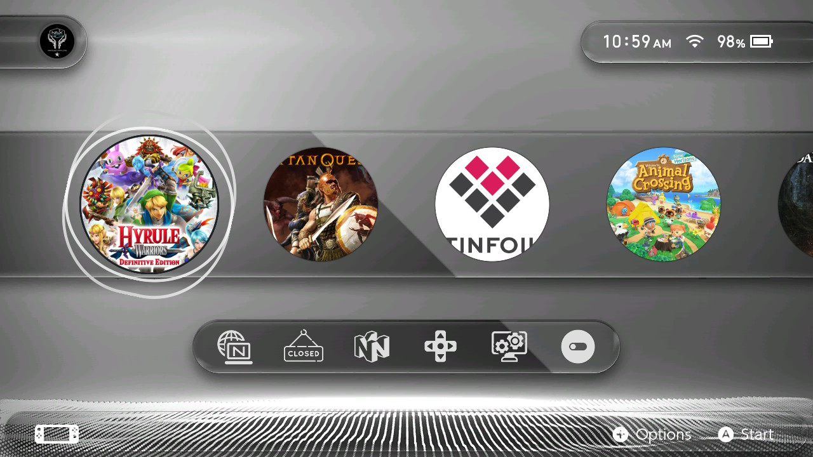

*NSX's **Mod AnimNX** theme. Highlights: the cursor changes its shape in a looping animation, growing animation on game & applet icons on hover*

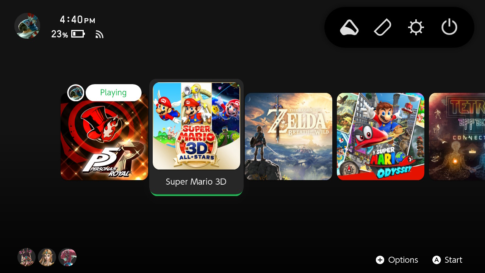

*My own **[Spotify Deck](https://themezer.net/packs/Spotify-Deck-596)** theme. Highlights: unlocking the console to home screen triggers a zoom out+fade in animation. Drop down animation for game titles, animated system applet icons, jumping dots for the All Software button.*

  

Please keep in mind that theme modding still is in "early" stage (well, to be completely honest, the scene is now kinda dead...) and full documentation has yet to be provided. Don't hesitate to reach out to the [Themezer Discord](https://discord.com/invite/nnm8wyM) server to ask for help.

  

## II. Requirements

  

- As I said, a minimum knowledge on themeing is mandatory. **Merely knowing how to background image swap using the injector definitely won't work out**. Be sure to **carefully** read the documentation found on [LayoutDocs](https://layoutdocs.themezer.net/) before going any further. While I'll be doing a quick refresher course, it would be too long to extra elaborate those subjects here.

- Windows 10 or 11

- [Switch Theme Injector + NXTheme Installer](https://github.com/exelix11/SwitchThemeInjector/releases) to compile and install your theme

- [Switch Layout Editor](https://github.com/FuryBaguette/SwitchLayoutEditor) to make animations and check the console's files

- A text editor. [Visual Studio Code](https://code.visualstudio.com/download) highly recommended.

  

Make sure you download the latest version for each aforementioned software.

  

## III. Before actually starting

  

### III.1. A few words on .szs files

  

Making themes means altering `.szs` files. Those are archives that contain the UI's graphical assets, all of them being stored in `.bflyt` and `.bflan` files. Basically, the whole UI is broken down into such files. So in order to create animations, we'll obviously need to tamper them.

  

Pictures, icons, text, and pretty much everything displayed on your console screen are *pane* objects that are contained in `.bflyt` files. These `.bflyt` files also contain information on panes' position/size/scale and their RGBA channels. In other words, those panes are what we will mess around with in this tutorial, **i.e. they are precisely the objects on which we will attach our animations.** So you might want to **check beforehand the**  `.bflyt`  **file that contains the pane you want to animate.**

  

In practice, **we'll essentially be focusing on**  `.bflan`  **files**, in which are stored parts of the animation data **for a specific**  `.bflyt`  **file**. Almost all the process is done through Switch Layout Editor which I'll start to introduce in the next subsection.

  

Getting back to `.szs` archives, you'll find those in `themes/systemData` on your SD card, these have already been extracted by the NXTheme Installer homebrew app. Please note that `.szs` files contain copyrighted stuff, making them illegal to share (that's the reason why modders implemented the `.nxtheme` format to get around this).

  

Each file corresponds to a specific menu,

  

| `.szs` file               | Menu       |
| ------------------ | ---------------- |
| `ResidentMenu.szs` | Home screen      |
| `Set.szs`          | Settings         |
| `Psl.szs`          | Player selection |
| `Flauncher.szs`    | All software     |
| `Lock.szs`         | Lock screen      |
| `MyPage.szs`       | User page        |

so if one wants to edit UI elements on the home page, we would need to grab the `ResidentMenu.szs` file. Likewise, if we want to make edits to the all apps section, `Flauncher.szs` is the file we will be working with. You get the idea.

As a side note, you'll also find in `themes/systemData` other `.szs` files that aren't listed here, e.g. `Option.szs`. **Those are not officially supported by the theme injector**, but you *still can* modify them using the extra templates feature provided by the injector. To see how, you might want to stay tuned for an upcoming tutorial.

### III.2. Layout Editor and diffing

  

You should be used to messing around with `.json` files and compiling themes with Switch Theme Injector, but maybe you're not familiar with Switch Layout Editor. Think of it as a `.szs` reader/archiver that also offers an actual on-screen preview of the panes' positioning, which is quite convenient for layout editing. It turns out that Layout Editor is also used for animation editing.

  

*NB: alternatively, you can use Switch Toolbox (also included with [LayoutKit](https://github.com/ThemezerNX/LayoutKit)), which is another piece of software that has pretty much the same purposes as Layout Editor. However, since I've been working with Layout Editor, I won't be covering Switch Toolbox here, but at the end of the day it's up to your preference. Just try them out.*

  

Once the animations have been implemented, we'll need to make a *layout diff* (as in *difference*). Basically, we want to work with two versions of the `.szs` file of interest: the first one stays untouched and the second one will contain all the edits that have been made through Layout Editor. Layout diffing is the process of comparing (*diffing*) both these `.szs` files and spitting out a layout file (the same type you've been using for your themes) that translates all the edits into JSON code format. The output `.json` file can then be used in Switch Theme Injector to compile the `.nxtheme` as you would normally do.

  

### III.3. Summing up the process

  

We'll go through these general steps that apply for any type of animation editing:

  

1. make two copies of the picked `.szs` file

2. edit one of them with our animations

3. layout diffing

4. compile the `.nxtheme` using the output/diffed `.json` and install onto the console (usual process with Switch Theme Injector and NXTheme Installer)

  

## IV. Tutorial

  

### o) Our goal

  

From now on, I'll only focus on creating an animation for the game icons on the home screen. **I want those icons to scale up when they are being selected, and to scale down to their initial size when the cursor goes off. This will be our goal throughout this tutorial section.** As I mentioned in the introduction section, tables will be provided later on if you want to experiment further and make more exotic animations.

  

### a) Setting up the workspace

  

To keep track on what we are doing, we'll first properly set up our workspace. Here I suggest a directory hierarchy that makes my own workflow efficient enough, but you can do as you please as you get the hang of knowing what you're doing.

  

1. Create a directory on your desktop and name it `animEdit`.

2. Go in `themes/systemData` on your Switch's SD card. Since I'm interested in editing the home screen for this example, I'll only grab `ResidentMenu.szs`.

3. Copy `ResidentMenu.szs`, paste it on your desktop and in `Desktop/animEdit`.

| 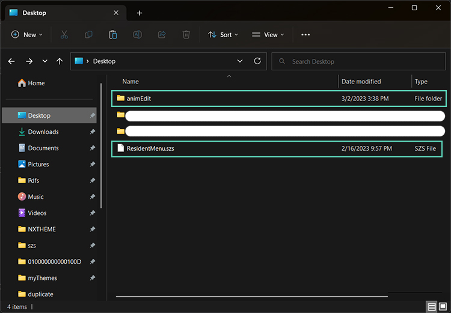 | 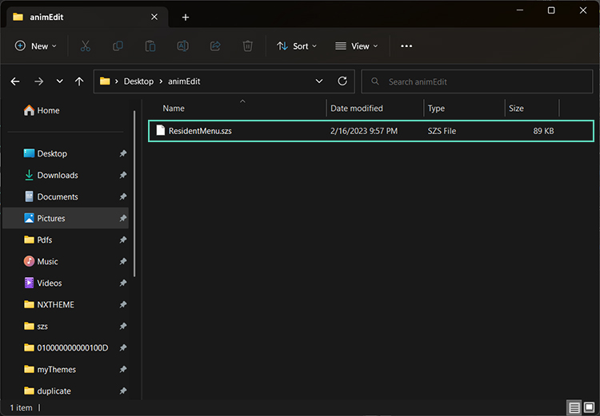 |
| ------------------------------------- | --------------------------------------------- |
| `Desktop/`                            | `Desktop/animEdit`                              |

   

Remember, we'll need one vanilla `.szs` and one copy of it that we'll edit, so we can diff them at the end. Here the desktop one will remain vanilla, so we will edit the one in `Desktop/animEdit`.

  

### b) Layout Editor

  

4. Open Layout Editor and load up `animEdit/ResidentMenu.szs`. You can simply drag and drop the file onto the window. A little box will open listing all the files contained in the `.szs` archive.

5. First, we will create the scaling up animation when the game icon is **selected**. In the box window, search for `RdtBtnIconGame_Active.bflan` and open by double clicking. A new window will show up. On this window, expand all the items by clicking the `+` icons.

  

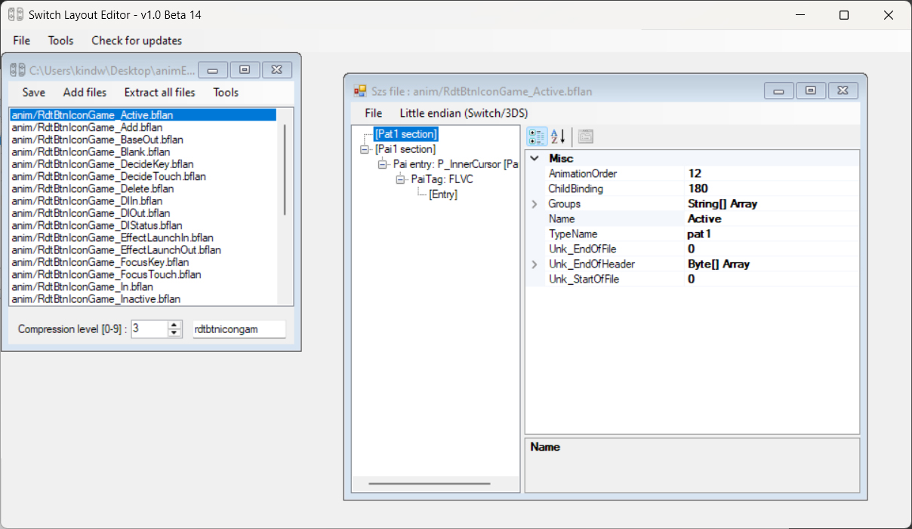

  

On the left are listed *some* panes contained in `RdtBtnIconGame.bflyt` (actually only one in this case, namely `P_InnerCursor`). Depending on what we want to achieve, we'll likely need to add more panes to this list. That will be the case here for our example.

On the right are displayed items that are used to define the animation behavior. Don't worry, we'll only need to edit a few of them.

Now I apologize in advance, but you'll need to blindly follow my instructions... for now. I will elaborate some of them throughout this section.
  

6. In the left panel, click on the first entry, `Pat1 section`. Then on the right panel,

	6.a. Set `AnimationBinding` to `0`

	6.b. Expand the `Groups` entry by clicking on the left arrow, and set the `[0]` field to `custom_G_Active` (the value isn't relevant here so this actually can be anything).

	6.c. In the left panel, click on the second entry, `Pai1 section` and set the `FrameSize` to `9999`.

  If you've done everything correctly, this should look like this.

| 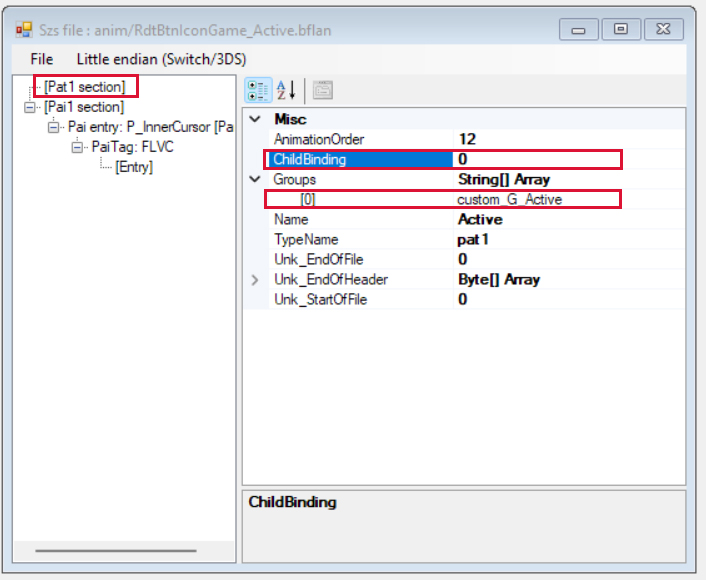 | 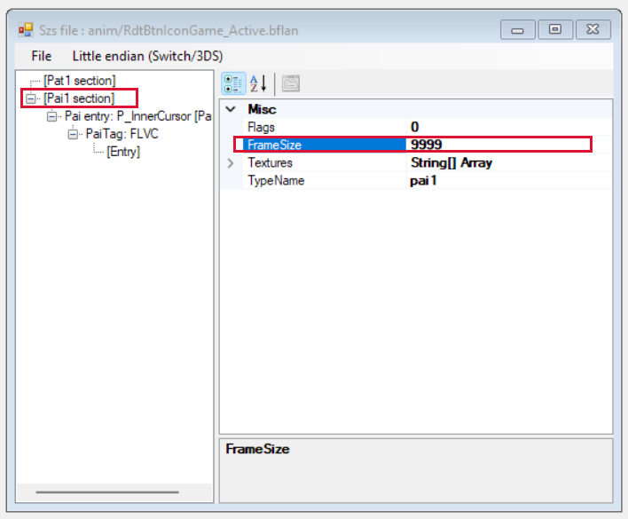 |
| ------------------------------------- | --------------------------------------------- |
| `Pat1 section`                            | `Pai1 section`                              |

**The whole 6th step is a recurring setup that always needs to be done in order to create any kind of animation, regardless of our current goal.** Now about creating our actual animation, we will do so by editing the `N_Root` pane from `RdtBtnIconGame.bflyt`, which means adding an entry to the pane list.

*NB: If you are familiar with themeing, `N_Root` is the pane that basically contains all the others in the `.bflyt`. Thus here we won't bother and we will animate the whole thing (including text, cursor, etc.), but nothing prevents you from being more specific and animate, for example, only the game title text. In this very case, you would add the `L_Balloon` entry instead.*

8. To add the `N_Root` pane to the list, left click on `Pai1 section` AND THEN right click on this same entry (otherwise this will mess up and yeah, this is dumb). Select the `Add Entry` option. The left panel should update with the newly added item at the end of the list. Click on it and rename it as `N_Root` in the right panel.

| ") | ") |
| --------------------------------------------------- | --------------------------------------------------- |
| Adding a pane (1)                                   | Adding a pane (2)                                       |

 9. Right click on `N_Root` in the pane list and select `Add Entry`. Expand the `N_Root` pane and rename the `PaiTag` entry as `FLPA`. Then again, add *2 sub-entries* to the `FLPA` entry.

Now, the following steps will define the scaling up animation we want to achieve.

10. Under `FLPA`, select the first `[Entry]`. The right panel will display another set of values. Some of them will actually matter, so please take note of these,

	 - `AnimationTarget` is the type of animation we choose to assign to our pane. This is basically here that we tell the pane to either scale up or down, translate along the x-axis or y-axis, or rotate around the z-axis clockwise/counterclockwise. Later on, this is where you might be interested in checking the tables to test the values associated to other types of animations.
	 - `KeyFrames` is... self-explanatory, I guess. This allows us to break our animation down into properly defined key frames.
	 - `DataType` refers to the type of our inputs in the KeyFrames field. **Just keep in mind that it should always be set as `2`** (meaning `float`). Although it's not really relevant here, you can follow [this link](https://layoutdocs.themezer.net/guide/layouts/usd-sections/) if you want to know a little more.

11. We will define our values as,
	11.a. `AnimationTarget` = `6`
	11.b. `DataType` = `2`

Leave the rest unchanged. Value `6` for `AnimationTarget` means *"scale along the x-axis"* (horizontally).

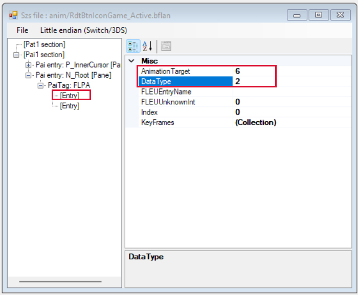

12. Select the `KeyFrames` item and click on the dots button that shows up. A new window will pop up in which we can add our key frames using the `Add` / `Remove` buttons at the bottom. Do as shown below.

")

This is how you should read this: at frame `0`, value is `1`, meaning that at the initial frame, the `N_Root` pane will keep its base ratio along **its horizontal axis**. Then, **up until frame `8`**, the pane will *progressively* scale up until reaching a `1.4` factor.

*NB1: Note that we defined earlier the `FrameSize` to be `9999` in the `Pai1 section`. We're good as long as this value is superior to the `Keyframe` maximum value, which is `8` here.*

*NB2: The `Blend` field refers to the function's slope (as in mathematics) that guides the animation. In layman's terms, it conditions the pace at which a pane will travel from one frame to another. Since the `Blend` values aren't documented and hard to figure out, I won't bother at all about it. My personal advice is always setting the value to `0`, which seems to make the pane's animation follow a simple linear function.*

13. Repeat the 10th, 11th and 12th steps to the second `[Entry]` under `FLPA`, but the `AnimationTarget` value should be `7` here instead of `6` here, meaning *"scale along the y-axis"* (vertically).

Now with all of these steps, we successfully made a scaling up animation when the game icon is **selected**. But what about when the icon is **being unselected**? Well, Switch's UI also offers us the possibility to tamper with that. If not done, the icon will actually keep its `1.4` factor **even after being unhovered**. So if we want to get things done properly, what follows is pretty much a mandatory thing to do. So, back to square one,

 14. Go back to the little box window that lists the `.szs` content and search for `RdtBtnIconGame_Inactive.bflan`. Open this file and repeat all the steps above starting from step 6. **At step 6.b., change the `[0]` value to `custom_G_Inactive`** (it doesn't actually matter but it's for convenience). For the animation, we will do things the other way around, so step 12 should look like this.

")

This way, the game icon will scale down to its initial size when being unselected.

Now, there is a last thing we must do before diffing, **adding groups**. More precisely, adding groups to the `RdtBtnIconGame.bflyt` file in this case. This is necessary to 1) prevent crashes that will very likely happen without doing so, and 2) "order the `.bflyt` to not follow its vanilla behavior". Yes, the phrasing is awkward and I can't develop much about groups anyway since I still don't grasp entirely how they function ; just keep in mind that the following step is mandatory. Basically, we need to create a group for each `.bflan` we tampered with, namely `RdtBtnIconGame_Active.bflan` and `RdtBtnIconGame_Inactive.bflan`.

15. Go back to the `.szs` box window and open up `RdtBtnIconGame.bflyt`. Don't mind the gray area on the right, just add a new group as shown in the image below, and make sure to **rename it the same name we defined in step 6.b.** (i.e. `custom_G_Active`). Then select the `Panes` item in the rectangle area below the list and type the panes listed in the `RdtBtnIconGame_Active.bflan` file. Each pane must be separated with a line break.

| ") | ") |
| ------------------------------------- | --------------------------------------------------- |
| Adding a group                        | Enumerating panes in the group                                   |

16. Repeat the operation for `RdtBtnIconGame_Inactive.bflan`. Same process except the group needs to be called `custom_G_Inactive`.

And with this, we are mostly done. Now is finally the time for diffing. **Make sure to save the edits in all the opened windows.**

17. Go back to the `.szs` box window, select `Tools` in the top menu, then the `This is the edited szs` option. You'll be prompted with a new window. Browse the unedited `ResidentMenu.szs` that we've been keeping in `Desktop/`, leave the checkbox as it is and click on `Generate diff`. 

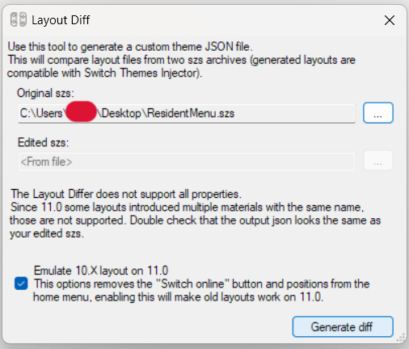

  
This will output a `.json` file we will be using to compile a `.nxtheme` with Switch Theme Injector. Finally done!

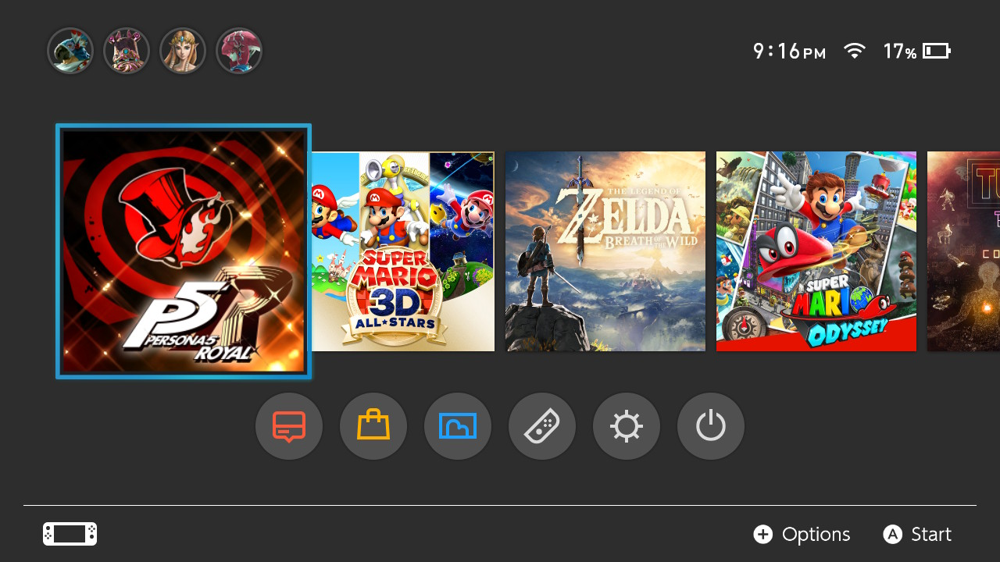

(hovered game icon scaling has been reduced to `1.2` since it was overlapping, I also hid the game title text)

*NB: Looking into the output `.json` code, you can see that groups were added at the end of the `RdtBtnIconGame.bflyt` section. There is also an added `Anims` section at the very end of the source code. Therefore, you totally could make animations without using Layout Editor at all... if you're willing to mess around with the whole `Anims` section's own syntax, that is.*

| 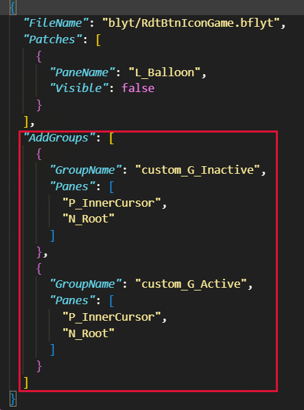 | 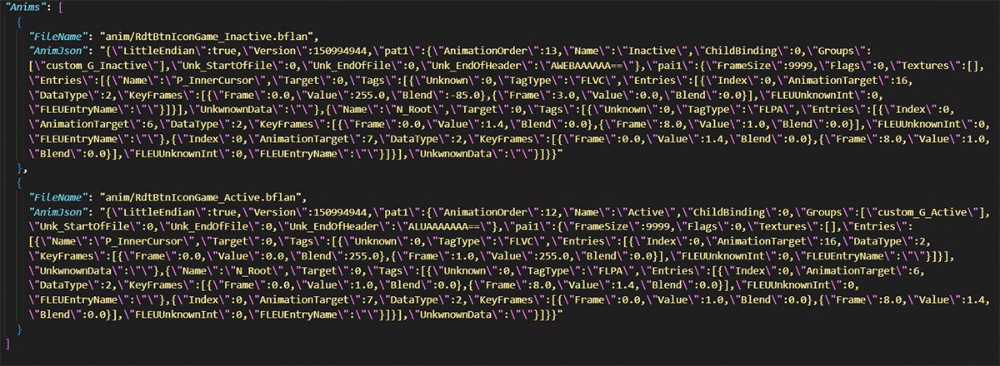 |
| ---------------------------------------------------- | -------------------------------------------- |
| `AddGroups` section                                  | `Anims` section               |

## V. Going further

### V.1. Active and Inactive states

For example, if we wanted to animate the settings applet button on the home screen, we would have searched for `RdtBtnSet_Active.bflan` and `RdtBtnSet_Inactive.bflan`. In fact, a few UI elements come as a pair of `.bflan` files named `[associated_bflyt_name]_Active.bflan` / `[associated_bflyt_name]_Inactive.bflan`. These `.bflan` dictate the state of the panes contained in `[associated_bflyt_name].bflyt`, when they are being selected by the cursor (Active) and unselected (Inactive). There are a couple more similar `.bflan` files following the same logic, like the `[associated_bflyt_name]_FocusKey.bflan` / `[associated_bflyt_name]_UnfocusKey.bflan` ones, but I won't discuss that here.

It's also worth noting that the edits made for Inactive states will actually overwrite the USD data you might have defined in your `.json` code (e.g. pane's position, colors, etc.). For example, if you've set the album button's x-coordinate to `660px` in your `.json` code while it is defined as `680px` in its Inactive `.bflan`, the `680px` value will take priority over the `660px` one and be applied.

### V.2. Looping animations

It is possible to make a loop for an animation. Such a thing can be seen in Migush's [JAG layout](https://themezer.net/layouts/homemenu/JAG-Layout-2) where selected game icons follow a scale up and down idle animation. All you have to do to make a looping animation is to set the `Flags` value to `1` (while `0` disables the loop) in the `Pai1 section` of a `.bflan` file. Unfortunately, **more complex animations that combine multiple transformations (among scaling, translating and rotating) can't be achieved properly** since the flag is applied to the whole `.bflan`. To be more explicit, a game icon wouldn't be able to move `10px` above AND THEN follow a looping scale up and down. In such a case, the linear displacement would also be looped.

### V.3. Fade in and fade out animations

While it's too convoluted to make changing colors animations (as I said in my introduction speech), we still can tinker with a pane's alpha (transparency) channel. If you've guessed it, this allows us to very easily make fade in and fade out animations.

Let's say I want a blinking cursor for the navigation menu in the settings applet. This time, we'll load up `Set.szs` in Layout Editor. Here are the steps,

1. Open `BtnNav_Root_Active.bflan`. **As always when creating custom animations,** do the proper modifications to the `Pat0` and `Pai0` sections. Add the `N_BtnFocusKey` (cursor) pane to the list, create a **`FLVC` entry** (not `FLPA`!) right under it, and then another entry under `FLVC`. I chose to make my key frames as shown below. Notice that `AnimationTarget` value is `16` here.
2. We'll also edit `BtnNav_Root_Inactive.bflan`, otherwise navigating the tabs will interrupt the cursor animation and lock it to a certain frame (same behavior as in our previous game icon animation). Considering that, we simply "reset" `N_BtnFocusKey`'s state (after adding this pane to the list) by setting its alpha channel to `0` at frame `0`.
3. Then again, for each `.bflan` file, create properly named groups in the `RootGroup` section of `BtnNav_Root.bflyt`. **Save all your edits.**
4. Layout diff, compile and install, and there you go: now you have a blinking cursor.

| ") | ") |
| ------------------------------------------ | ------------------------------------------ |
| Adding `FLVC` entry (Active)               | Adding `FLVC` entry (Inactive)             |

### V.4. Useful tables

#### V.4.a. AnimationTarget

Values expected for the key frames values are in `float` type.
| `AnimationTarget` (`FLPA PaiTag`) | Transformation                     |
| --------------- | ---------------------------------- |
| `0`               | x-axis translation                 |
| `1`               | y-axis translation                 |
| `2`               |                                    |
| `3`               |                                    |
| `4`               | z-axis rotation (clockwise)        |
| `5`               | z-axis rotation (counterclockwise) |
| `6`               | x-axis scale (base ratio is `1`)                      |
| `7`               | y-axis scale (base ratio is `1`)                      |
| `8`               | pane size along x-axis             |
| `9`               | pane size along y-axis                                   |

For the `FLVC PaiTag`, the key frames values range from 0 (invisible) to 255 (opaque).
| `AnimationTarget` (`FLVC PaiTag`) | Channel | Corner    | 
| --------------------------------- | ------- | --- |
| `16`                             | alpha        | whole pane    |

*NB: I haven't tested this thoroughly for RGB channels (now you're probably seeing how annoying it is), but my guess is that `AnimationTarget` values follow a fairly simple pattern: `0`, `1`, `2` = RGB for a specific pane corner, `3` = alpha for that same corner ; `4`, `5`, `6` = RGB for another corner, `7` = alpha for this second corner, ..., `16` = alpha channel for the whole pane.*

#### V.4.b. Notable files

##### ResidentMenu.szs (home screen)

| `.bflyt`           | UI element                 | Notable `.bflan` files                         |
| ------------------ | -------------------------- | ---------------------------------------------- |
| `RdtBase`          | whole home screen menu     | `RdtBase_Enter`                                |
| `RdtBtnIconGame`   | game button                | `RdtBtnIconGame_Active`, `RdtBtnGame_Inactive` |
| `RdtBtnPvr`        | album applet button        | `RdtBtnPvr_Active`, `RdtBtnPvr_Inactive`       |
| `RdtBtnCtrl`       | controllers applet button  | `RdtBtnCtrl_Active`, `RdtBtnCtrl_Inactive`     |
| `RdtBtnSet`        | settings applet button     | `RdtBtnSet_Active`, `RdtBtnSet_Inactive`       |
| `RdtBtnPow`        | power button               | `RdtBtnPow_Active`, `RdtBtnPow_Inactive`       |
| `RdtBtnFullLauncher` | all software applet button | `RdtBtnFullLauncher_Active`, `RdtBtnFullLauncher_Inactive`                                               |

##### Set.szs (settings applet)

| `.bflyt`      | UI element          | Notable `.bflan` files                       |
| ------------- | ------------------- | -------------------------------------------- |
| `BtnNav_Root` | Navigation menu tab | `BtnNav_Root_Active`, `BtnNav_Root_Inactive` |

##### Flauncher.szs (all software applet)

| `.bflyt`             | UI element                                 | Notable `.bflan` files                             |
| -------------------- | ------------------------------------------ | -------------------------------------------------- |
| `FlcBtnIconGame`     | game icon in the main and group screens               | `FlcBtnIconGame_Active`, `FlcBtnIconGame_Inactive` |
| `FlcBtnIconGameEdit` | game icon in the create group and add/remove software screens | `FlcBtnIconGameEdit_Active`, `FlcBtnIconGameEdit_Inactive`                                                   |

## VI. Special thanks

- The whole Nintendo Switch modding and homebrew scenes
- Big thanks to exelix and Migush for all the tips
