# Themes for unsupported applets: going further
*Written by [Capybara](https://themezer.net/creators/382997176307154945), June 2023*

It's possible to theme basically all the menus that aren't officially supported by Switch Theme Injector using the usual `.json` layout patching method and some extra steps. Custom background images for unsupported menus *may be* achievable as well using the extra templates feature of the injector, although you'll have to do your own testing to make it work properly as the original script relies on texture replacement within the `.btnx` and thus may lead to mild UI glitches if you picked the wrong textures. For more details on how to implement custom backgrounds to unsupported applets, please refer to [exelix's documentation](https://github.com/exelix11/SwitchThemeInjector/blob/master/SzsPatching.md).

In this tutorial, I'll only be focusing on how to patch unsupported `.szs`, e.g. `PhotoViewer.szs` (Album applet). In other words, making themes for those menus.

**szs themes contain copyrighted assets and are intended for personal use. For sharing purposes, use nxthemes.**

## Table of contents

- **[I. qlaunch applets](#i-qlaunch-applets)**
- **[II. Other applets](#ii-other-applets)**
- **[III. Tutorial](#iii-tutorial)**
	- [III.1. Extracting the .szs](#iii1-extracting-the-szs)
	- [III.2. Diffpatching and installation](#iii2-diffpatching-and-installation)
- **[IV. Additional notes](#iv-additional-notes)**
- **[V. Special thanks](#v-special-thanks)**

## Prerequisites

- Fair knowledge on layout editing and diffing, see [LayoutDocs](layoutdocs.themezer.net/)
- [Switch Layout Editor](https://github.com/FuryBaguette/SwitchLayoutEditor/releases/tag/beta15)
- [Goldleaf](https://github.com/XorTroll/Goldleaf)
- [hactool](https://github.com/SciresM/hactool/releases/tag/1.4.0)
- Lockpick_RCM for providing keys to hactool
- A text editor, [Visual Studio Code](https://code.visualstudio.com/) highly recommended
- Windows 10 or 11

## I. qlaunch applets

Each installed app on the Switch is a title that has a unique id.

`qlaunch` is the one that contains the home menu applets under it. Some of those are officially supported by the injector (e.g. `ResidentMenu.szs`, `Flaunch.szs`, `Set.szs`, etc.), while some aren't (e.g. `Option.szs`). Those `.szs` files have already been extracted by the NXTheme Installer homebrew app and should be located at `themes/systemData` on your SD card, so diffing them is a straightforward process as you don't need to manually extract these files. I won't elaborate this here, rather I recommend checking out [SodaSoba's tutorial](https://layoutdocs.themezer.net/guide/diffpatch/) on the subject.

`qlaunch`'s id is `0100000000001000`.

## II. Other applets

Applets that aren't part of `qlaunch` (except for the player selection menu and user page which are officially supported) need manual extracting and installation. Here are the general steps:

- export the desired applet title as an `.nsp` using Goldleaf
- extract the `romFS` from this `.nsp` using hactool, which will subsequently extract `.szs` files we can work with
- make the `.json` layout, then patch the `.szs` with it
- use Atmosphere's LayeredFS to install the patched `.szs` (i.e. drag and drop onto your SD card)

Important note: Firmware updates may provide different `.szs` files along with them, meaning you will have to redo these steps **at each firmware update** to avoid possible incompatibility issues (likely crashes). NXTheme Installer automates this process for the applets it supports, as you maybe noticed. Fortunately, there shouldn't be any need to rewrite your `.json` layout, as `.bflyt` and `.bflan` files should carry over firmware updates, so you can keep your `.json` as-is.

For reference, an exhaustive list of titles is provided on the [switchbrew wiki](https://switchbrew.org/wiki/Title_list). Here are some id's that might be of interest:

|      Title     | Title id           |         Applet         |
|:--------------:|--------------------|:----------------------:|
|  `photoViewer` | `010000000000100D` |          Album         |
|  `overlayDisp` | `010000000000100C` | Overlay (quick settings, notifications, etc.) |
|  `controller`  | `0100000000001003` |    Controllers menu    |
| `playerSelect` | `0100000000001007` |  Player selection menu |
|    `myPage`    | `0100000000001013` |        User page       |

Side note: The following will allow editing the `common.szs` files associated to `Psl.szs` (player selection menu) and `MyPage.szs` (user page), which by the way *aren't* part of `qlaunch`. This especially makes the bottom line removal possible for these applets, which is otherwise not possible by solely using Switch Theme Injector as it only supports the `common.szs` from `qlaunch`.

## III. Tutorial

As an example, my goal here is to theme the Album applet.

### III.1. Extracting the .szs

1) We need to check the Album's title id on the switchbrew wiki and take note of it (`010000000000100D`).

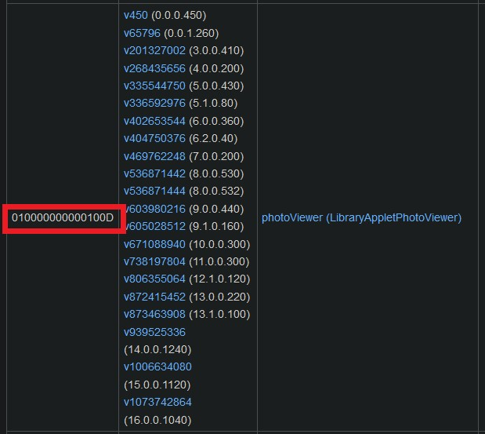

2) Open Goldleaf on your Switch and navigate to `Manage console contents` > `NAND SYSTEM`.

**Warning: Now be careful, although we won't do anything major here, you don't want to accidentally mess up your NAND.**


| 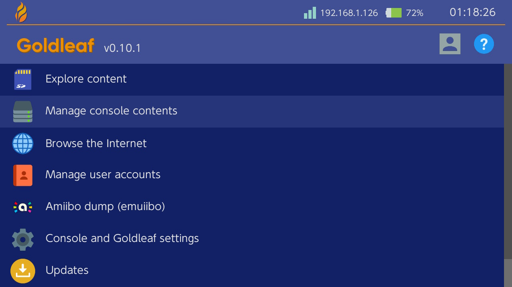 |  |
| ------------------------------------- | --------------------------------------------- |

Look for the applet's title id within the list (`010000000000100D` here), select it, press A and choose `Export`. Select `Yes` to confirm the title NSP export. The Album applet should then be exported and saved as `010000000000100D.nsp` at `switch/Goldleaf/export/title`.

| 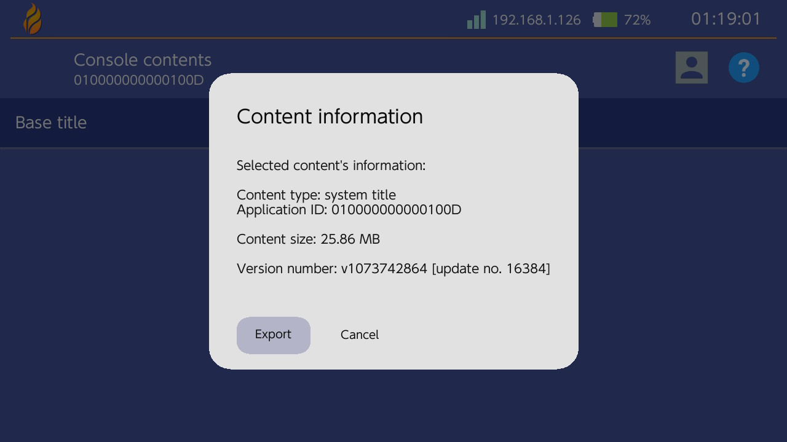 | 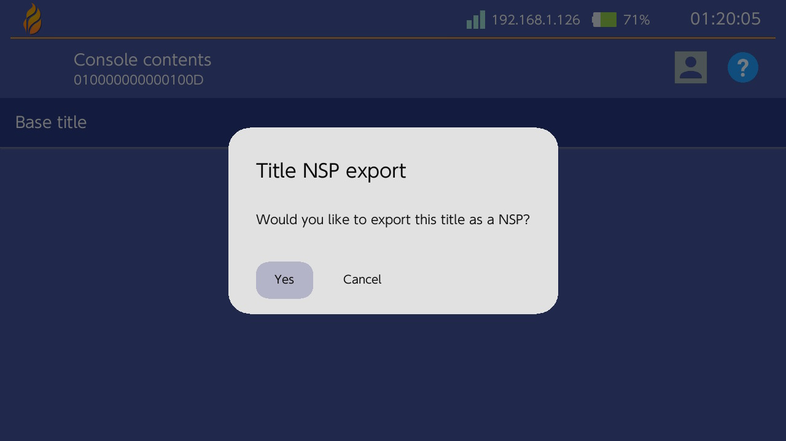 |
| ------------------------------------- | --------------------------------------------- |

3) We can proceed on extracting the `.szs` off the exported `.nsp`.
First, download hactool and put `hactool.exe` into a new directory (which I named unsApplets here). [Dump your keys](https://nh-server.github.io/switch-guide/extras/dumping_title_keys/) if you haven't done it already, then drop them into your hactool directory along with the exported `.nsp`.

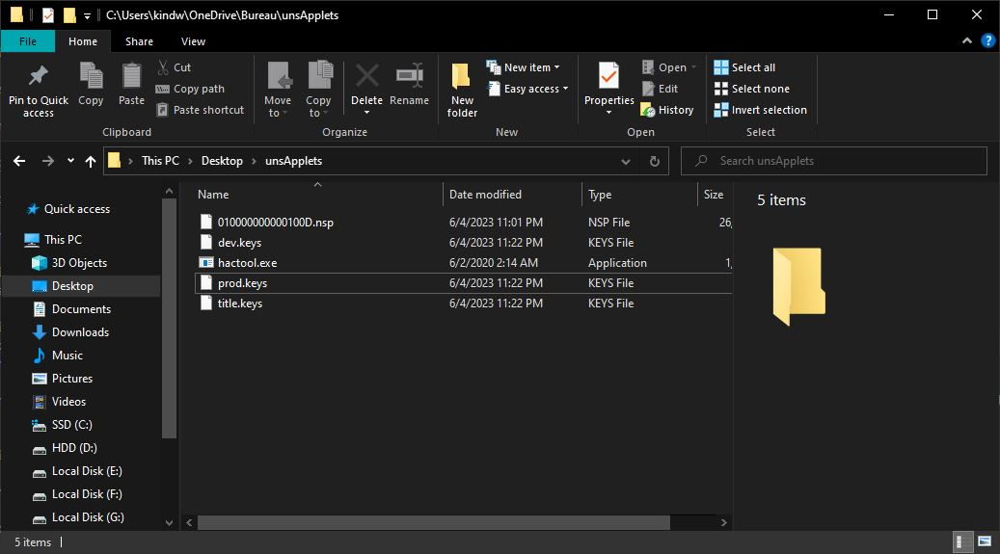

4) Press `Win` + `R`, type `cmd` and press `Enter` to open the command line. Browse your hactool folder by typing `cd ` (keep the space at the end), then drag and drop the hactool folder onto the command line. Press `Enter` to confirm.

5) Copy and paste the following command, press `Enter` to confirm.

`hactool -t pfs0 --pfs0dir=photoViewer 010000000000100D.nsp`

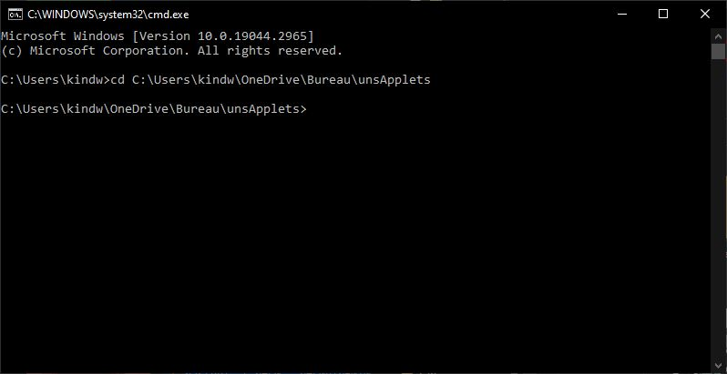

Side note: Don't pay attention to the `[WARN] prod.keys does not exist` error if you happen to get it.

This will output two `.nca` files into the `photoViewer` folder, using `010000000000100D.nsp` as the input file. The `.szs` files we're interested in are contained in the largest `.nca` (one should be a few KBs and the other 25-ish MBs).

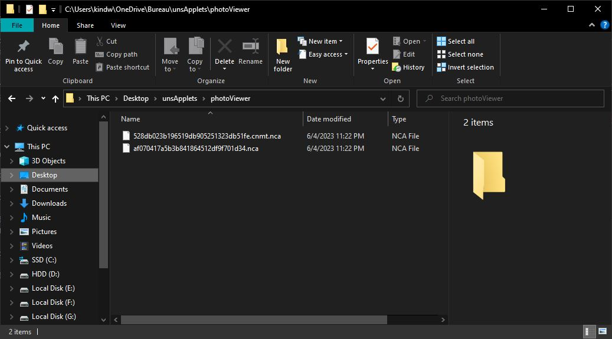

6) We'll do a second extraction using the largest `.nca`.

`hactool -k prod.keys --romfsdir=romfs photoViewer/af070417a5b3b841864512df9f701d34.nca`

This will extract the `romFS` into the `romfs` folder. The `.szs` have been extracted as well and should be located at `romfs/lyt`.

| 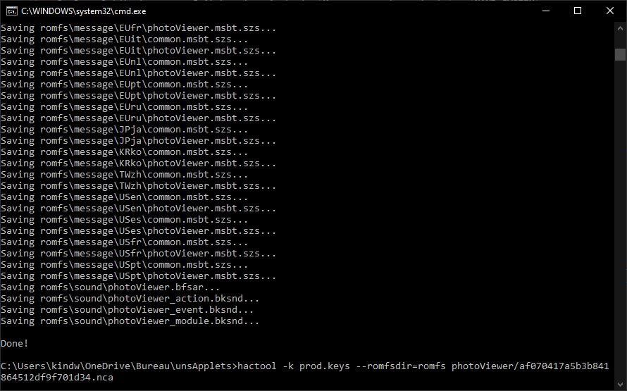 | 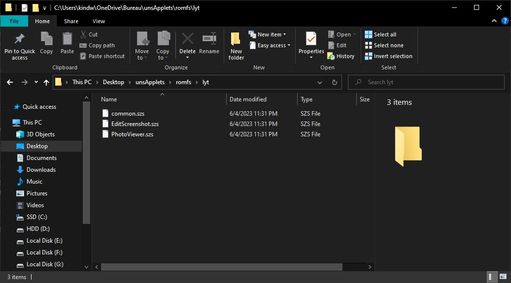 |
| ------------------------------------- | --------------------------------------------- |

Side note: Refer to this [repository](https://github.com/SciresM/hactool) for more info on using hactool.

### III.2. Diffpatching and installation

We're basically done with the extra steps required to theme non-`qlaunch` unsupported applets as we finally got our hands on their `.szs` files. What's next now is just the usual `.szs` diffpatching with Layout Editor. I won't be implementing animations here so I'll just stick with Visual Studio Code to write my `.json`. Note that the `.json`'s header must be edited accordingly, like so in this case:

```json
"PatchName": "Your theme name",
"AuthorName": "Capybara",
"TargetName": "PhotoViewer.szs"
```

What differs is the installation process, which is normally automated by NXTheme Installer for supported applets. Patched `.szs` must be copied to `atmosphere/contents/<title id>/romfs/lyt/<file>.szs`, i.e. `atmosphere/contents/010000000000100D/romfs/lyt/PhotoViewer.szs` here. It's normal that these directories don't exist, you have to create them and make sure to reproduce this folder tree. Atmosphere's LayeredFS should then load the custom theme instead of the default one.

| 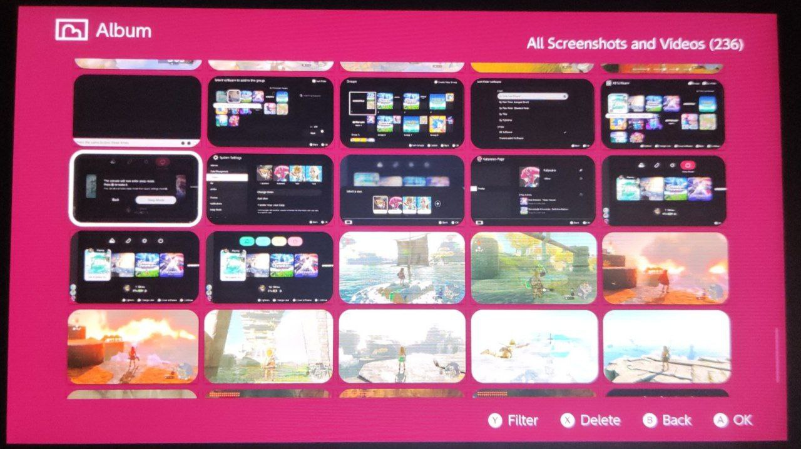 | 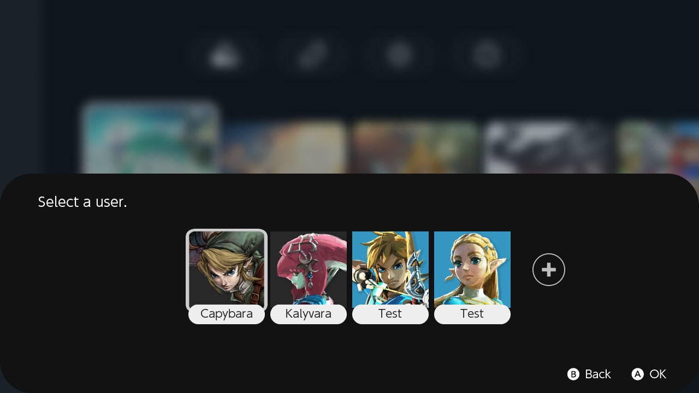 |
| ------------------------------------- | --------------------------------------------- |


*No more bottom line in player selection, finally!*

## IV. Additional notes

- Installing a modified `.szs` theme from `overlayDisp` blackscreens the console on boot and I'm not sure why
- Further testing for other applets is needed

## V. Special thanks

- exelix for his advice
- contributors of the NX scene
